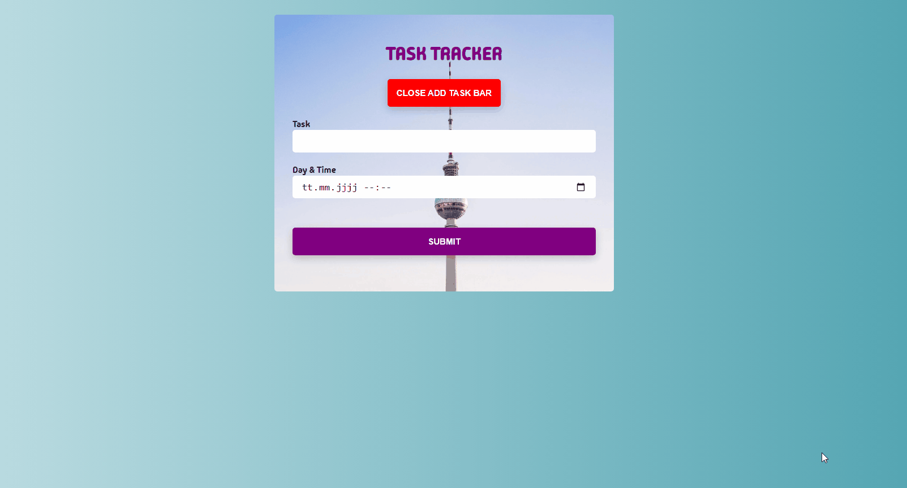

# Task-Tracker-React


## Demo
[Task Tracker App Live](https://task-tracker-w-react.netlify.app/)


## Project Skeleton

```
| Todo App(folder)
|
SOLUTION
├── public
│     └── index.html
├── src
│    ├── components
│    │       ├── helper 
│    │       ├── pages 
│    │               ├── Home.jsx 
│    │       ├── Home.jsx
│    │       ├── Home.jsx
│    │       ├── AddTask.jsx
│    │       ├── ShowTasks.jsx         
│    ├── App.css
│    ├── App.js
│    └── index.js
├── .gitignore
├── package-lock.json
├── package.json
└── README.md
```

## Expected Outcome



## Objective

Build a Todo App using ReactJS.

### At the end of the project, following topics are to be covered;

- HTML

- CSS

- JS

- ReactJS

### At the end of the project, you will be able to;

- improve coding skills within HTML & CSS & JS & ReactJS.

- use git commands (push, pull, commit, add etc.) and Github as Version Control System.

## Steps to Solution

- Step 1: Create React App using `npx create-react-app todo-app`

- Step 2: Build Todo App.

- Step 3: You can use CSS frameworks like Bootstrap, React Bootstrap, TailwindCss or Native Css, Sass, Module Css.

- Step 4: You can use local storage to store data.


